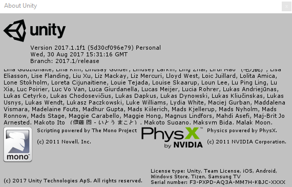
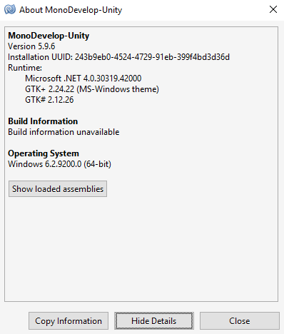

# Document
`jskyzero` `2017/11/04`

本分支将存放公用开发的文档，参考资料等。

## 版本说明

+ 分支(Branch)
  + 每个程序员都有自己的分支
  + develop为开发中的最新分支
  + master为稳定分支

+ 迭代
  + 将按照`目标->成果->修改的新目标`的循环来迭代开发
  + 迭代周期以周为单位

## 规格说明

+ 开发说明
  + Unity软件版本：2017.1.1f1

  

  + Unity自带的Mono版本

  

+ 文件格式
  + C#代码文件(*.cs)
    + 编码：UTF-8 (without BOM)
    + 换行：LF (Linux下换行)
  + 美术素材
    + 任意符合要求的格式
  + 音乐素材
    + 任意符合要求的格式
  + 其他文件
    + 大家能互相打得开的格式